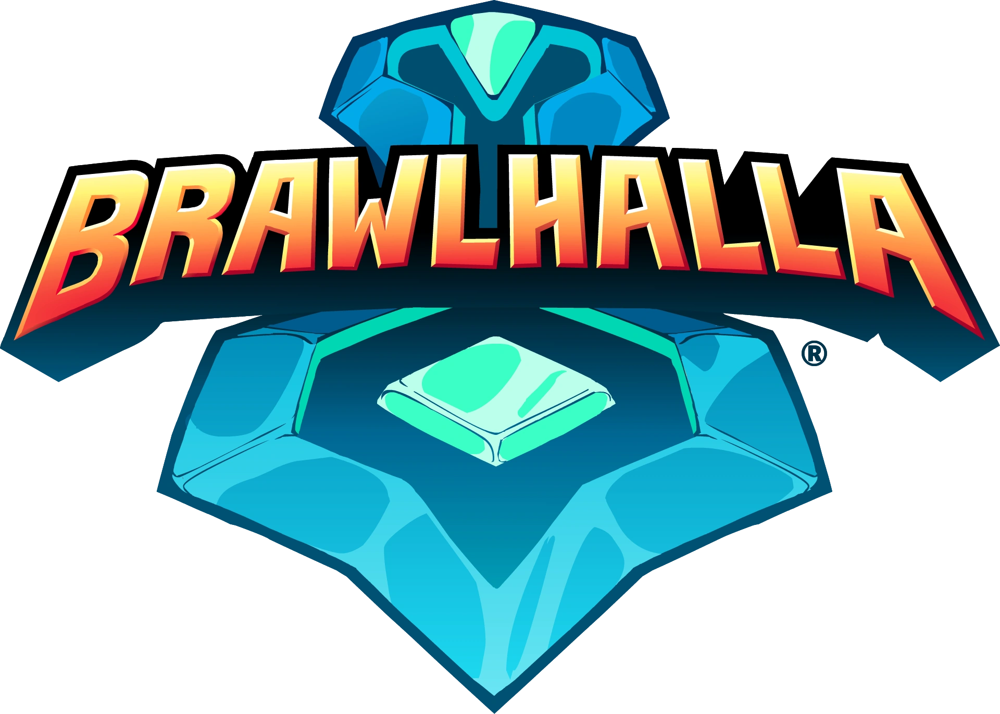

<a name="readme-top"></a>

<!-- PROJECT SHIELDS -->

[![Contributors][contributors-shield]][contributors-url]
[![Forks][forks-shield]][forks-url]
[![Stargazers][stars-shield]][stars-url]
[![Issues][issues-shield]][issues-url]
[![MIT License][license-shield]][license-url]

<!-- PROJECT LOGO -->
<br />
<div align="center">
  <a href="https://github.com/tomimelo/bhapi.js">
    
  </a>

<h3 align="center">Brawlhalla API</h3>

  <p align="center">
    A TypeScript/JavaScript library to interact with Brawlhalla API. It also has extended functionalities not included in original API
    <br />
    <br />
    <a href="https://github.com/tomimelo/bhapi.js"><strong>Explore the docs »</strong></a>
    <br />
    <br />
    <a href="https://github.com/tomimelo/bhapi.js">View Demo</a>
    ·
    <a href="https://github.com/tomimelo/bhapi.js/issues">Report Bug</a>
    ·
    <a href="https://github.com/tomimelo/bhapi.js/issues">Request Feature</a>
  </p>
</div>

<!-- TABLE OF CONTENTS -->
<details>
  <summary>Table of Contents</summary>
  <ol>
    <li>
      <a href="#about-the-project">About The Project</a>
      <ul>
        <li><a href="#built-with">Built With</a></li>
      </ul>
    </li>
    <li>
      <a href="#getting-started">Getting Started</a>
      <ul>
        <li><a href="#prerequisites">Prerequisites</a></li>
        <li><a href="#installation">Installation</a></li>
      </ul>
    </li>
    <li>
      <a href="#usage">Usage</a>
      <ul>
        <li>
          <a href="#methods">Methods</a>
          <ul>
            <li><a href="#new-brawlhallaapiconfig--brawlhallaapi-object">new BrawlhallaAPI</a></li>
            <li><a href="#searchbysteamidsteamid--promiseplayer">searchBySteamId</a></li>
            <li><a href="#getrankingsoptions--promisereadonlyarrayranking">getRankings</a></li>
            <li><a href="#getplayerstatsbrawlhallaid--promiseplayerstats">getPlayerStats</a></li>
            <li><a href="#getplayerrankeddatabrawlhallaid--promiseplayerrankeddata">getPlayerRankedData</a></li>
            <li><a href="#getclanclanid--promiseclan">getClan</a></li>
            <li><a href="#getlegends--promisereadonlyarraylegenddata">getLegends</a></li>
            <li><a href="#getlegendlegendid--promiselegend">getLegend</a></li>
            <li><a href="#getweapons--promisereadonlyarrayweapon">getWeapons</a></li>
          </ul>
        </li>
      </ul>
    </li>
    <li><a href="#contributing">Contributing</a></li>
    <li><a href="#license">License</a></li>
    <li><a href="#contact">Contact</a></li>
  </ol>
</details>

<!-- ABOUT THE PROJECT -->

# About The Project

TypeScript/JavaScript wrapper around Brawlhalla API. Consume the API easily through different methods and access extended functionalities not included originally in the API. This is not an official Brawlhalla Application and it has no connection with Brawlhalla nor its developers.

<p align="right">(<a href="#readme-top">back to top</a>)</p>

## Built With

- [![Node][node.js]][node-url]
- [![TypeScript][typescript]][typescript-url]

<p align="right">(<a href="#readme-top">back to top</a>)</p>

<!-- GETTING STARTED -->

# Getting Started

You need to follow some steps to get this running.

## Prerequisites

You need to acquire an API key from Brawlhalla. If you do not have an API key, please [read this](https://dev.brawlhalla.com/#authentication) to know how to get one.

## Installation

Install the package using your package manager of choice.

```sh
npm install bhapi.js --save
```

<p align="right">(<a href="#readme-top">back to top</a>)</p>

<!-- USAGE EXAMPLES -->

# Usage

You may then import `BrawlhallaAPI` into your project.

```js
// ES Modules
import BrawlhallaAPI from 'bhapi.js'

// CommonJS
const BrawlhallaAPI = require('bhapi.js')
```

After that, you need to instantiate the class providing the Brawlhalla API key in the config and you're ready to use it!

```js
const bhapi = new BrawlhallaAPI({ apiKey: 'YOUR-API-KEY' })

const legends = await bhapi.getLegends()
```

## Methods

### `new BrawlhallaAPI(config) ===> BrawlhallaAPI object`

Constructor to create a new `BrawlhallaAPI` object. You need to provide a `config` object

1.  Constructor Arguments

    - **config:** {BrawlhallaAPIConfig}. Config object that contains the API key

2.  Example Use

```js
const config = {
  apiKey: 'YOUR-API-KEY',
}

const bhapi = new BrawlhallaAPI(config)
```

### `searchBySteamID(steamId) ===> Promise<Player>`

Find a player by Steam ID

1.  Method Arguments

    - **steamId:** {SteamId64} (string). A player’s Steam ID in format steamID64 (ex 76561198025185087).

2.  Example Use

```js
const config = {
  apiKey: 'YOUR-API-KEY',
}

const bhapi = new BrawlhallaAPI(config)

const player = await bhapi.searchBySteamID('76561198025185087')

// {
//     "brawlhalla_id": 2,
//     "name": ""
// }
```

### `getRankings(options) ===> Promise<ReadonlyArray<Ranking>>`

Get rankings ordered and paginated 50 at a time

1.  Method Arguments

    - **options:** {RankingsOptions}. Search options.
      Default values = {
      **bracket**: '1v1',
      **region**: 'all',
      **page**: 1,
      }

2.  Example Use

```js
const config = {
  apiKey: 'YOUR-API-KEY',
}

const bhapi = new BrawlhallaAPI(config)

const options = {
  bracket: '1v1',
  region: 'brz',
  page: 1,
  name: 'John Doe',
}

const rankings = await bhapi.getRankings(options)

// [
//     {
//         "rank": "1",
//         "name": "John Doe",
//         "brawlhalla_id": 20877,
//         "best_legend": 25,
//         "best_legend_games": 719,
//         "best_legend_wins": 642,
//         "rating": 2872,
//         "tier": "Diamond",
//         "games": 719,
//         "wins": 642,
//         "region": "BRZ",
//         "peak_rating": 2872
//     },
//     ...
// ]
```

### `getPlayerStats(brawlhallaId) ===> Promise<PlayerStats>`

Get all stats about a player

1.  Method Arguments

    - **brawlhallaId:** {number}. The Brawlhalla ID of a player.

2.  Example Use

```js
const config = {
  apiKey: 'YOUR-API-KEY',
}

const bhapi = new BrawlhallaAPI(config)

const playerStats = await bhapi.getPlayerStats(2)

// {
//     "brawlhalla_id": 2,
//     "name": "bmg | dan",
//     "xp": 191718,
//     "level": 47,
//     "xp_percentage": 0.6252398209337,
//     "games": 8,
//     "wins": 2,
//     "damagebomb": "29",
//     "damagemine": "0",
//     "damagespikeball": "0",
//     "damagesidekick": "14",
//     "hitsnowball": 0,
//     "kobomb": 0,
//     "komine": 0,
//     "kospikeball": 0,
//     "kosidekick": 0,
//     ...(more data)
// }
```

### `getPlayerRankedData(brawlhallaId) ===> Promise<PlayerRankedData>`

Get ranked data about a player

1.  Method Arguments

    - **brawlhallaId:** {number}. The Brawlhalla ID of a player.

2.  Example Use

```js
const config = {
  apiKey: 'YOUR-API-KEY',
}

const bhapi = new BrawlhallaAPI(config)

const playerRankedData = await bhapi.getPlayerRankedData(2)

// {
//     "name": "bmg | dan",
//     "brawlhalla_id": 2,
//     "rating": 1745,
//     "peak_rating": 1792,
//     "tier": "Platinum 2",
//     "wins": 207,
//     "games": 391,
//     "region": "US-E",
//     "global_rank": 5698,
//     "region_rank": 1644,
//     "legends": [
//         {
//             "legend_id": 4,
//             "legend_name_key": "cassidy",
//             "rating": 1736,
//             "peak_rating": 1792,
//             "tier": "Platinum 1",
//             "wins": 161,
//             "games": 300
//         },
//      ... (more data)
// }
```

### `getClan(clanId) ===> Promise<Clan>`

Get information about a specific clan and its members

1.  Method Arguments

    - **clanId:** {number}. The clan ID of a clan.

2.  Example Use

```js
const config = {
  apiKey: 'YOUR-API-KEY',
}

const bhapi = new BrawlhallaAPI(config)

const clan = await bhapi.getClan(1)

// {
//     "clan_id": 1,
//     "clan_name": "Blue Mammoth Games",
//     "clan_create_date": 1464206400,
//     "clan_xp": "86962",
//     "clan": [
//         {
//             "brawlhalla_id": 3,
//             "name": "[BMG] Chill Penguin X",
//             "rank": "Leader",
//             "join_date": 1464206400,
//             "xp": 6664
//         },
//         {
//             "brawlhalla_id": 2,
//             "name": "bmg | dan",
//             "rank": "Officer",
//             "join_date": 1464221047,
//             "xp": 4492
//         }
//     ]
// }
```

### `getLegends() ===> Promise<ReadonlyArray<LegendData>>`

Get summarized data for all legends. Use `getLegend(legendId)` for more details about a legend.

1.  Example Use

```js
const config = {
  apiKey: 'YOUR-API-KEY',
}

const bhapi = new BrawlhallaAPI(config)

const legends = await bhapi.getLegends()

// [
//     {
//         "legend_id": 3,
//         "legend_name_key": "bodvar",
//         "bio_name": "B\u00f6dvar",
//         "bio_aka": "The Unconquered Viking, The Great Bear",
//         "weapon_one": "Hammer",
//         "weapon_two": "Sword",
//         "strength": "6",
//         "dexterity": "6",
//         "defense": "5",
//         "speed": "5"
//     },
//     {
//         "legend_id": 4,
//         "legend_name_key": "cassidy",
//         "bio_name": "Cassidy",
//         "bio_aka": "The Marshal of the Old West",
//         "weapon_one": "Pistol",
//         "weapon_two": "Hammer",
//         "strength": "6",
//         "dexterity": "8",
//         "defense": "4",
//         "speed": "4"
//     },  ...
// ]
```

### `getLegend(legendId) ===> Promise<Legend>`

Get detailed data about a specific legend.

1.  Method Arguments

    - **legendId:** {number}. The legend ID of a legend.

2.  Example Use

```js
const config = {
  apiKey: 'YOUR-API-KEY',
}

const bhapi = new BrawlhallaAPI(config)

const legend = await bhapi.getLegend(3)

// {
//     "legend_id": 3,
//     "legend_name_key": "bodvar",
//     "bio_name": "B\u00f6dvar",
//     "bio_aka": "The Unconquered Viking, The Great Bear",
//     "bio_quote": "\"I speak, you noble vikings, of a warrior who surpassed you all. I tell of a great bear-man who overcame giants and armies, and of how he came to leave our world and challenge the Gods.\"",
//     "bio_quote_about_attrib": "\"                   -The Saga of B\u00f6dvar Bearson, first stanza\"",
//     "bio_quote_from": "\"Listen you nine-mothered bridge troll, I'm coming in, and the first beer I'm drinking is the one in your fist.\"",
//     "bio_quote_from_attrib": "\"                   -B\u00f6dvar to Heimdall, guardian of the gates of Asgard\"",
//     "bio_text": "Born of a viking mother and bear father, ...",
//     "bot_name": "B\u00f6tvar",
//     "weapon_one": "Hammer",
//     "weapon_two": "Sword",
//     "strength": "6",
//     "dexterity": "6",
//     "defense": "5",
//     "speed": "5"
// }
```

### `getWeapons() ===> Promise<ReadonlyArray<Weapon>>`

Get all weapons from legends.

1.  Example Use

```js
const config = {
  apiKey: 'YOUR-API-KEY',
}

const bhapi = new BrawlhallaAPI(config)

const weapons = await bhapi.getWeapons()

// [
//     { name: 'Hammer' },
//     { name: 'Sword' },
//     { name: 'Pistol' },
//     { name: 'RocketLance' },
//     { name: 'Spear' },
//     { name: 'Katar' },
//     { name: 'Axe' },
//     { name: 'Bow' },
//     { name: 'Fists' },
//     { name: 'Scythe' },
//     { name: 'Cannon' },
//     { name: 'Orb' },
//     { name: 'Greatsword' }
// ]
```

<!-- CONTRIBUTING -->

# Contributing

Contributions are what make the open source community such an amazing place to learn, inspire, and create. Any contributions you make are **greatly appreciated**.

If you have a suggestion that would make this better, please fork the repo and create a pull request. You can also simply open an issue with the tag "enhancement".
Don't forget to give the project a star! Thanks again!

1. Fork the Project
2. Create your Feature Branch (`git checkout -b feature/AmazingFeature`)
3. Commit your Changes (`git commit -m 'Add some AmazingFeature'`)
4. Push to the Branch (`git push origin feature/AmazingFeature`)
5. Open a Pull Request

<p align="right">(<a href="#readme-top">back to top</a>)</p>

<!-- LICENSE -->

# License

Distributed under the MIT License. See `LICENSE.txt` for more information.

<p align="right">(<a href="#readme-top">back to top</a>)</p>

<!-- CONTACT -->

# Contact

Tomas Melone - [@tomzdotjs](https://twitter.com/tomzdotjs)

Project Link: [https://github.com/tomimelo/bhapi.js](https://github.com/tomimelo/bhapi.js)

<p align="right">(<a href="#readme-top">back to top</a>)</p>

<!-- MARKDOWN LINKS & IMAGES -->
<!-- https://www.markdownguide.org/basic-syntax/#reference-style-links -->

[contributors-shield]: https://img.shields.io/github/contributors/tomimelo/bhapi.js.svg?style=for-the-badge
[contributors-url]: https://github.com/tomimelo/bhapi.js/graphs/contributors
[forks-shield]: https://img.shields.io/github/forks/tomimelo/bhapi.js.svg?style=for-the-badge
[forks-url]: https://github.com/tomimelo/bhapi.js/network/members
[stars-shield]: https://img.shields.io/github/stars/tomimelo/bhapi.js.svg?style=for-the-badge
[stars-url]: https://github.com/tomimelo/bhapi.js/stargazers
[issues-shield]: https://img.shields.io/github/issues/tomimelo/bhapi.js.svg?style=for-the-badge
[issues-url]: https://github.com/tomimelo/bhapi.js/issues
[license-shield]: https://img.shields.io/github/license/tomimelo/bhapi.js.svg?style=for-the-badge
[license-url]: https://github.com/tomimelo/bhapi.js/blob/master/LICENSE.txt
[node.js]: https://img.shields.io/badge/-Node.js-3C873A?style=for-the-badge&logo=Node.js&logoColor=white
[node-url]: https://nodejs.org/
[typescript]: https://img.shields.io/badge/TypeScript-007ACC?style=for-the-badge&logo=typescript&logoColor=white
[typescript-url]: https://www.typescriptlang.org/
